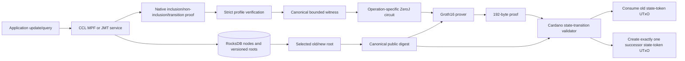
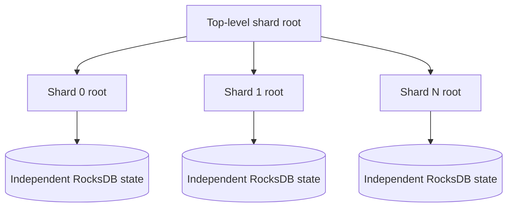

# Practical large-state Poseidon MPF/JMT guide

- **Status:** implemented local engineering guidance for ADR-0042
- **Baseline:** CCL `0.8.0-pre5`
- **Profile:** `zeroj-poseidon-authenticated-state-v1`
- **Measurements:** [MPF 5M](../benchmarks/poseidon-mpf-5m-2026-08-02.md) and
  [JMT 5M](../benchmarks/poseidon-jmt-5m-2026-08-03.md)

## Executive answer

Yes: a practical application can authenticate millions of entries without putting the whole
state in memory or in a circuit. Keep the MPF or JMT in RocksDB, publish only its root, read one
native path for the requested operation, verify and normalize that path off-chain, and prove
the bounded path with an operation-specific circuit. The Groth16 verifier receives a
192-byte proof and a small fixed public statement; it does not receive the multi-gigabyte
database or native Merkle path.

Both implemented structures reached five million entries locally:

| Choice | Best fit | Measured complete-root profile | Median Groth16 prove | Main trade-off |
|---|---|---:|---:|---|
| Poseidon MPF | compact native single-key proofs; existing MPF state | S9 | 4.173 s | variable compressed Patricia depth; no physical-delete primitive yet |
| Poseidon JMT | versioned roots, rollback, pruning, update-heavy state | S12 | 2.901 s | larger native proofs and more explicit version/storage policy |

The JMT native proof being larger is not an on-chain disadvantage in this design. The native
proof is private prover input; both measured Groth16 proofs are 192 bytes and use the same
on-chain verification budget. JMT is faster here because its operation-specific binary-path
circuit is materially smaller, not because Groth16 inherently favors JMT.

These are measurements for two deterministic roots, not general entry-count limits. Circuit
capacity is a path bound. Later updates or adversarial key selection can create a deeper path,
so services must scan/monitor depth and define an over-bound route.

## Application flow

The state-token policy is external to Groth16. The validator release binds the exact circuit
manifest, R1CS and VK identities, validator-template SHA-256 and script hash, network, token
policy/name, signer, and one-shot genesis attestation. A deployment must independently prove
that the policy minted a total supply of exactly one and cannot mint again.

## Implemented primitives

Do not use one generic circuit for every operation. Each primitive has a narrower statement,
smaller constraint surface, exact template ID, manifest, R1CS hash, and proving key.

| Statement | MPF | JMT | Meaning |
|---|:---:|:---:|---|
| Inclusion | yes | yes | key/value commitment exists under the root |
| Non-inclusion: empty | yes | yes | queried path reaches the canonical empty case |
| Non-inclusion: different leaf | yes | yes | terminal leaf is canonical and has a different key |
| Value update | yes | yes | same canonical key, old value to new value, old root to new root |
| Insert into empty path | yes | yes | separately typed empty-case insertion |
| Insert beside different leaf | yes | yes | separately typed collision/different-leaf insertion |
| Tombstone update | no | yes | replace value with the profile's tombstone commitment |
| Physical delete/collapse | deferred | not exposed | needs additional canonical-collapse witnesses |
| Multiproof/batch update | deferred | deferred | no frozen CCL host oracle/profile yet |

The retained full-semantics `ZkMpf` overload is a migration/reference facade. JMT intentionally
has no universal public compatibility facade. New applications should call the named operation
classes or `PoseidonMpfCircuitTemplates` / `PoseidonJmtCircuitTemplates` so operation identity
stays explicit.

## What scales and what does not

Keep four independent quantities separate:

| Object | Scaling variable | Five-million-entry observation |
|---|---|---|
| RocksDB state | entries, retained versions, write amplification, compaction | MPF workspace about 24 GiB; JMT workspace about 3.0 GiB at handoff |
| Native proof | actual path encoding | MPF 805–939 B sampled; JMT 2,744–3,161 B sampled |
| Circuit | configured maximum steps/levels and operation | MPF S9: 56,635 constraints; JMT S12: 14,057 constraints |
| Groth16 proof/on-chain verification | proof system and public-input count | 192 B proof, 432 B VK, fixed measured Julc budget |

The database does not need to fit in Java heap. Both loaders stream deterministic entries and
write durable batches. The JMT five-million load used a fixed 4 GiB JVM maximum and peaked at
about 2.59 GB observed heap; the MPF load peaked at about 1.30 GB heap. Proving still needs
several gigabytes of process memory for these circuits, so run the prover as a separately
budgeted service rather than inside a request thread.

## Choosing a profile

The exact depth census, rather than entry count alone, selects a profile.

| Structure/root | Common profile | Coverage | Complete measured profile |
|---|---:|---:|---:|
| MPF seed 25, 5M | S8 | 4,999,782 / 5,000,000 (99.99564%) | S9 |
| JMT seed 42, 5M | S8 | 4,987,028 / 5,000,000 (99.74056%) | S12 |
| JMT seed 42, 5M | S10 | 4,999,968 / 5,000,000 (99.99936%) | S12 |

A sensible production router can approve two or more exact profiles and choose the smallest
one that fits a verified witness. The validator must explicitly recognize the corresponding
manifest/VK; it must never infer compatibility from dimensions. If no approved profile fits,
reject or route to a separately approved fallback. Silent truncation or padding outside the
canonical rules is unsafe.

For adversarial public keys, apply a protocol key derivation/domain that callers cannot freely
grind, or use a fixed-depth/sharded design. Poseidon outputs make honest paths approximately
balanced, but do not turn a measured maximum into a cryptographic bound.

## MPF versus JMT

Choose MPF when compatibility with an existing MPF root and compact non-ZK proofs matters.
Its radix-16 Patricia compression gives short paths in ordinary data. The measured five-million
root needed only 5–9 branch steps. MPF is therefore a good membership/read structure, and the
new inclusion circuit reduced proving from the historical generic circuit's 213.826 seconds to
about 4.17 seconds at S9.

Choose JMT when version history is part of the application model. The CCL-backed host stores a
root per version, supports reopen validation, temporary updates, rollback, and pruning. Its
native proof is larger, but the Groth16 layer removes that payload from the validator. The
measured S12 circuit covers the complete five-million root and proves in about 2.90 seconds.

Do not choose solely from the workspace sizes above: the runs used different datasets, batch
policies, retained histories, and RocksDB histories. Benchmark the intended retention,
compaction, update, and backup policy on production-like hardware.

## Very large or high-update applications

When one tree becomes operationally unwieldy, shard authenticated state by a stable prefix or
application domain:

Sharding bounds rebuild/compaction blast radius, enables parallel provers, and maps naturally
to separate Cardano state UTxOs when concurrency is required. It adds routing and a top-level
root policy. Either prove the shard-root relation in a second small circuit or make the shard
identifier and root explicit in the anchored state.

For large batches, do not generate one proof per changed leaf unless independent authorization
requires it. Commit updates off-chain and prove a bounded batch transition or recursively
aggregate operation proofs. Those circuits are not part of ADR-0042 yet; their host semantics,
maximum batch size, failure atomicity, and exact public statement must be frozen before they
can be safely implemented.

A fixed-depth sparse Merkle tree gives a protocol-enforced depth when adversarial depth tails
are unacceptable, at the price of a longer uncompressed binary path. Verkle or polynomial
commitment trees can improve large multiproofs but require a different commitment/circuit and
on-chain verification story; they are not drop-in replacements for this Poseidon/Groth16
profile.

## Correctness and security boundary

Local tests cover host/circuit golden vectors, CCL compatibility, malicious witness mutations,
exact R1CS and VK identity, artifact parsing, cross-operation and MPF/JMT proof replay, mutated
public roots, real value transitions, durable reopen, rollback, and Julc VM evaluation. They
support the conclusion that the implementation is internally consistent and scales on the
measured machine.

They do not establish production cryptographic assurance. Before protecting value:

1. freeze every deployed operation/profile and publish its canonical manifest, exact R1CS
   SHA-256, VK identity, Poseidon fingerprint, compiler version, and validator-template hash;
2. obtain independent circuit/cryptographic review and address its findings;
3. conduct or import a reviewed Groth16 ceremony for each exact circuit, with auditable
   contribution and destruction evidence;
4. validate the full state-token transaction on Yaci and the selected public network using
   current protocol parameters;
5. enforce the one-shot total-supply-one state-token policy and preserve its genesis evidence;
6. operate backup/restore, corruption detection, compaction, version retention, rollback, and
   disaster-rebuild procedures; and
7. monitor proof depth, prover latency/RSS, RocksDB backlog, root/version drift, and rejected
   over-bound requests.

Benchmark bundles deliberately contain `productionApproved=false`. The release API rejects a
benchmark manifest on mainnet, but this guard is not a substitute for the external gates.
