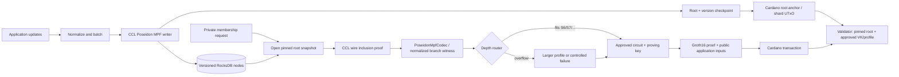

# Practical large-state Poseidon MPF/MPT report

- **Status:** engineering assessment and production plan
- **Date:** 2026-08-02
- **Applies to:** ZeroJ Poseidon MPF v2, CCL `0.8.0-pre4`, [GitHub issue #25](https://github.com/bloxbean/zeroj/issues/25)
- **Measurement detail:** [five-million-entry benchmark](benchmarks/poseidon-mpf-5m-2026-08-02.md)
- **Protocol decision:** [ADR-0041](adr/0041-poseidon-mpf-production-readiness-and-load-benchmark.md)

## Executive answer

Yes, a practical application can keep millions of authenticated key/value entries off-chain
without keeping the tree in Java heap. The measured ZeroJ design already does this: CCL keeps
the Poseidon MPF in RocksDB, the application reads only one root-to-leaf path, and the circuit
receives that path rather than the five-million-entry state.

The present implementation establishes storage scalability and end-to-end correctness for a
sampled inclusion proof. It does **not** yet establish interactive production proving:

- the five-million-entry RocksDB MPF completed with about 1.22 GiB peak observed Java heap;
- a CCL inclusion proof took about 12 ms at the median;
- the complete root contains paths from 5 through 9 MPF steps;
- the benchmarked 8-step circuit covers 4,999,782 entries, but misses 218 nine-step paths;
- that generic 8-step circuit has 17,399,380 constraints and took 3m 33.826s to prove; and
- its 192-byte Groth16 proof verified off-chain in about 154 ms and in the warm Julc VM host
  path in about 3 ms.

For the exact current root, the complete scan says a 9-step bound covers every path. Entry
count is not a hard circuit-capacity formula, however. Honest hashed keys give a balanced
distribution in expectation, while the maximum is a tail event and untrusted clients can
grind candidate keys for common prefixes. A production service therefore needs a depth policy,
a larger fallback profile, or a structure with a protocol-enforced fixed depth.

The recommended near-term architecture is:

1. keep CCL `0.8.0-pre4`, Poseidon MPF v2, and versioned RocksDB;
2. build an inclusion-only, branch-only circuit instead of using the current generic
   inclusion/exclusion circuit for this workload;
3. approve several circuit/VK profiles and route each proof to the smallest profile that fits,
   with a larger fallback;
4. anchor versioned roots on Cardano and retain the corresponding RocksDB snapshots;
5. batch large update sets and, when updates are not trusted, prove `oldRoot -> newRoot` once per
   batch rather than proving every updated entry independently; and
6. complete a trusted setup, independent review, formal-verification plan, and live Cardano
   budget/deployment tests before protecting value.

If the workload needs a hard bound against adversarial keys, a fixed-depth sparse Merkle tree
or a sharded forest is a better protocol shape than relying on the observed MPF depth tail.
Verkle trees are attractive for large multi-key witnesses, but they are not a near-term drop-in
replacement for ZeroJ's current Poseidon/Groth16/Cardano stack.

## Separate the three proof/state objects

Most apparent scaling contradictions disappear when these objects are kept separate:

| Object | Where it lives | What scales it |
|---|---|---|
| Authenticated state | RocksDB MPF nodes and versioned roots | entries, update rate, retained versions, compaction |
| CCL MPF proof | one encoded authentication path | actual branch-step depth |
| Groth16 proof | succinct proof of the circuit statement | fixed circuit and public-input count; 192 B in this run |

The circuit never loads five million leaves. It checks one bounded path against one root. The
database can therefore be much larger than RAM as long as its node store supports point reads,
atomic batches, snapshots/version roots, and pruning.

## What already exists in ZeroJ

The reusable public gadget is
[`ZkMpf.verifyInclusionPoseidon`](../zeroj-circuit-lib/src/main/java/com/bloxbean/cardano/zeroj/circuit/lib/zk/ZkMpf.java),
with the flattened witness shape in
[`ZkMpfProof`](../zeroj-circuit-lib/src/main/java/com/bloxbean/cardano/zeroj/circuit/lib/zk/ZkMpfProof.java).
The public annotated example is
[`AnnotatedMpfPrivateRegistryInclusion`](../zeroj-examples/src/main/java/com/bloxbean/cardano/zeroj/examples/annotation/AnnotatedMpfPrivateRegistryInclusion.java).

CCL proof conversion and the explicit bound check are in
[`PoseidonMpfCodec`](../zeroj-mpf-poseidon/src/main/java/com/bloxbean/cardano/zeroj/mpf/poseidon/PoseidonMpfCodec.java).
The exact circuit used for the high-volume run is
[`PoseidonMpfInclusionCircuit`](../zeroj-mpf-poseidon-load/src/main/java/com/bloxbean/cardano/zeroj/mpf/load/PoseidonMpfInclusionCircuit.java),
and the benchmark CLI defaults `--max-steps` to 8 in
[`LoadOptions`](../zeroj-mpf-poseidon-load/src/main/java/com/bloxbean/cardano/zeroj/mpf/load/LoadOptions.java).

Consequently, “the 8-step circuit” is not a hard-coded limit throughout ZeroJ. `maxSteps` is a
circuit parameter. The benchmark circuit is package-private in a non-published load module;
there is not yet a named, audited, production 8-step artifact with an approved verification
key. The generic gadget and parameterized annotated example are part of ZeroJ.

The off-chain adapter uses CCL's custom `HashFunction`, custom `CommitmentScheme`, wire-proof,
and persistent-node APIs. CCL `0.8.0-pre4` is sufficient; the development release is not
required. Its release specifically includes MPF RocksDB performance, resource-safety, and
observability work, while the custom hash constructors arrived in the preceding preview
([CCL release history](https://github.com/bloxbean/cardano-client-lib/releases/tag/v0.8.0-pre4)).

## What an MPF “step” means

A step is not the height of an ordinary binary Merkle tree and is not a count of entries.
CCL MPF is a compressed radix-16 Patricia structure. One inclusion-proof step represents a
branch at which the query path must authenticate neighboring subtrees. A compressed extension
prefix is folded into the following branch record and does not add a separate step.

For approximately balanced 16-way paths, a typical depth grows near `log16(entryCount)`, but
the maximum across every entry grows faster than the typical value. That is why five million
entries, for which `log16(5,000,000)` is about 5.56, produced mostly 6- and 7-step proofs but
still had a small 9-step tail.

## Exact observed depth, not a universal capacity table

The new streaming scanner visited every current-root entry and selected retained historical
roots. It counts the same branch records as decoded CCL inclusion proofs and does not
materialize the trie in heap.

| Entries in deterministic seed-25 root | Maximum steps | Smallest measured profile covering that exact root | Scan time |
|---:|---:|---:|---:|
| 1,000 | 5 | S5 | 0.404 s |
| 10,000 | 6 | S6 | 1.432 s |
| 20,000 | 6 | S6 | 1.833 s |
| 100,000 | 7 | S7 | 10.292 s |
| 1,000,000 | 8 | S8 | 86.836 s |
| 5,000,000 | 9 | S9 | 562.235 s |

These values are exact for the measured insertion history, but are not hard capacities for
other datasets or future versions of this database.

The complete five-million-entry distribution is:

| Steps | Entries | Share | Cumulative share |
|---:|---:|---:|---:|
| 5 | 129 | 0.002580% | 0.002580% |
| 6 | 2,589,301 | 51.786020% | 51.788600% |
| 7 | 2,318,120 | 46.362400% | 98.151000% |
| 8 | 92,232 | 1.844640% | 99.995640% |
| 9 | 218 | 0.004360% | 100.000000% |

This distribution makes profile routing useful: S6 handles about 51.79% of this root, S7
handles about 98.15%, S8 handles about 99.99564%, and S9 is required for exact coverage.
Whether that saves meaningful proving time must be measured after the circuit is specialized.

The proposed rule “3 steps for 10k or 20k entries” is not safe. At the exact 10,000-entry
root, only 47 entries (0.47%) had three steps. S4 covered 71.60%, S5 covered 99.39%, and S6 was
needed for all 10,000 entries. Even the 1,000-entry root needed S5 for complete coverage.

A reasonable operational planning table is therefore:

| Dataset size measured here | Exact measured profile | One-step-headroom profile |
|---:|---:|---:|
| 1,000 | S5 | S6 |
| 10,000-20,000 | S6 | S7 |
| 100,000 | S7 | S8 |
| 1,000,000 | S8 | S9 |
| 5,000,000 | S9 | S10 |

Headroom reduces ordinary overflow risk but is still not a mathematical guarantee. A hard
policy needs admission enforcement, overflow routing, or a structurally fixed-depth tree.

## Why hashed keys are balanced but do not create a hard bound

The user's intuition is right for normal operation: hashing application keys before choosing
the path removes application-key locality, so honest keys should spread across the trie.
The measured distribution is consistent with that behavior.

Three qualifications matter:

1. Poseidon outputs a BLS12-381 scalar field element, not an arbitrary 256-bit string. ZeroJ
   serializes that scalar as 32 unsigned big-endian bytes. The leading path bits therefore do
   not cover the full 256-bit space uniformly; in particular, the high nibble is restricted by
   the field modulus.
2. Uniformity describes a probability distribution. It does not state that the maximum path
   in a finite set equals its mean or median. The 218 nine-step paths are the observed tail.
3. If an untrusted party may choose a key after trying many candidates, it can grind for a
   desired prefix. The hash remains collision-resistant, but the party has converted an honest
   random-key assumption into an adversarial search problem.

Scroll makes this distinction explicit in its zkTrie design: it hashes original keys with
Poseidon to distribute paths, caps the binary trie at 248 lower bits to avoid finite-field bit
ambiguity, and contracts one-leaf subtrees
([Scroll zkTrie](https://docs.scroll.io/en/technology/sequencer/zktrie/)). A future ZeroJ
profile could similarly use a canonical lower-bit path, but that would change every key path
and root and therefore must be a new, deliberately migrated commitment profile. It would give
a structural maximum path length, not make Patricia-path tails disappear.

## Measured ZeroJ circuit cost

The current generic gadget is linear in `maxSteps`, but the constant per step is very large.
A sizing run compiled the same benchmark circuit for S3 through S9 with a padded valid
witness. Constraint and wire counts are exact; the wall times are one noisy run and are not
proof-generation benchmarks.

| Profile | Constraints | Wires | Private inputs | R1CS compile | Witness calculation |
|---:|---:|---:|---:|---:|---:|
| S3 | 6,274,975 | 14,561,029 | 296 | 7.835 s | 8.088 s |
| S4 | 8,499,856 | 19,192,576 | 373 | 8.852 s | 10.868 s |
| S5 | 10,724,737 | 23,824,123 | 450 | 11.667 s | 12.854 s |
| S6 | 12,949,618 | 28,455,670 | 527 | 13.750 s | 16.427 s |
| S7 | 15,174,499 | 33,087,217 | 604 | 16.756 s | 17.750 s |
| S8 | 17,399,380 | 37,718,764 | 681 | 20.942 s | 21.475 s |
| S9 | 19,624,261 | 42,350,311 | 758 | 17.664 s | 17.949 s |

Every additional slot adds exactly 2,224,881 constraints, 4,631,547 wires, and 77 private
inputs in this circuit shape. S3 uses a `2^23` constraint domain; S4 through S7 require
`2^24`; and S8/S9 require `2^25`. The power-of-two boundary means setup and proving cost can
jump at S3→S4 and S7→S8 rather than changing smoothly.

There is no measured full setup/prove result for S3-S7 or S9 yet. It would be incorrect to
advertise S3 as “quick” merely because it is smaller. It still has more than six million
constraints. Extrapolating the exact linear circuit shape to the protocol's 64-nibble path
limit gives about 141,992,716 constraints, which is a hard-bound option in theory but not a
practical form of the present implementation.

### Complete measured timing for the S8 run

All values below are from one Apple-silicon host and should not be treated as portable service
objectives.

| Stage | Result | Frequency/meaning |
|---|---:|---|
| Five-million-entry load | approximately 7h including an intentional restart | initial dataset build |
| Timed resumed load | 4.07M entries in 20,827.443 s; 195.415 entries/s | initial/bulk build |
| Complete five-million path scan | 562.235 s | audit/maintenance operation |
| CCL MPF proof generation | 12.222 ms median; 25.071 ms p95 | per query |
| Independent MPF proof verification | 11.839 ms median; 20.781 ms p95 | optional per query/gate |
| Witness encoding | 0.387 ms median; 0.997 ms p95 | per query |
| Circuit graph build | 3.058 s | compile/setup workflow |
| R1CS compile | 23.504 s | compile/setup workflow |
| Witness circuit rebuild | 1.747 s | per proof in measured pipeline |
| Witness calculation | 17.291 s | per proof |
| Local sparse setup | 895.707 s (14m 55.707s) | once per exact circuit; insecure benchmark setup |
| Existing key load | 2.897 ms | process/key-open path |
| Groth16 proof generation | 213.826 s (3m 33.826s) | per proof |
| Positive off-chain verification | 153.868 ms | per proof |
| Mutated-root rejection | 148.395 ms | negative test |
| Warm Julc VM evaluation | 3.162 ms | host-side VM timing, not transaction latency |
| Warm Julc mutated-root rejection | 2.979 ms | host-side negative test |

The S8 setup produced a 10,269,150,876-byte sparse key store and observed about 12.27 GiB peak
Java heap. The Groth16 proof is 192 bytes and the compressed verification key is 432 bytes.
The Julc execution budget was CPU 2,627,770,348 and memory 177,749; it still needs comparison
with the selected network's live protocol parameters and a real transaction test.

Three and a half minutes can be acceptable for asynchronous issuance, periodic compliance,
or low-frequency batch jobs. It is not acceptable for an interactive login, checkout, or
per-transaction proving service. More server hardware may help, but the first fix should be
the circuit, not the database.

## Why the current circuit is much larger than the Merkle work implies

`ZkMpf` is a general compatibility gadget. For every padded slot it validates and constructs
candidate logic for branch, fork, and leaf proof records, supports inclusion and several
exclusion shapes, dynamically indexes a 64-nibble secret path, and then selects the applicable
candidate. A valid flag does not remove already-created constraints.

The five-million-entry inclusion workload is narrower. Its proof path can be normalized to
branch records carrying:

- the compressed-prefix skip;
- four sibling hashes for the radix-16 branch;
- the query path position; and
- a validity/length representation for padding.

The production circuit should compute only that branch path. It should also pack the key path
or otherwise avoid repeatedly implementing dynamic access as a 64-element selector scan.
Exclusion, fork, and different-leaf proofs can remain in a separate circuit if an application
actually needs them.

This is also consistent with other ZK membership systems. Semaphore's current circuit has a
fixed `MAX_DEPTH`, an actual `merkleProofLength`, and a padded sibling array, but computes a
single binary Merkle-root path
([Semaphore circuit source](https://github.com/semaphore-protocol/semaphore/blob/main/packages/circuits/src/semaphore.circom)).
Its published depth-20 V4 circuit reports 6,431 nonlinear constraints and 6,454 wires. That is
not an apples-to-apples comparison—Semaphore uses a different curve, compiler, statement, and
binary tree—but it is strong directional evidence that millions of constraints are not an
intrinsic requirement for a short Poseidon membership path.

## Recommended application architecture

### Storage and memory model

Keep tree nodes and retained versions in RocksDB. Keep only these objects in memory:

- the current update batch;
- RocksDB block/memtable caches;
- a small upper-node or pair-hash cache;
- one or a bounded number of authentication paths; and
- the active circuit/prover working set.

The measured RocksDB reported 27.724 GB logical bytes and occupied about 14 GiB physically
after close while the Java load peak was about 1.22 GiB. The complete preserved benchmark
directory is larger because it also contains the 9.56 GiB Groth16 key store. This demonstrates
the relevant out-of-core algorithmic property; it does not yet optimize disk usage or write
throughput. The sampler measured Java heap, not full-process RSS, RocksDB native allocations,
or operating-system page cache. A constrained-memory and cold-cache run is still required to
set a production memory requirement.

If values are large, store only a domain-separated value commitment in the MPF leaf and keep
the payload in an object store or ordinary database. The authenticated index then scales with
keys and commitments rather than duplicating large payloads through versioned trie nodes.

An alternative hybrid used by Miden's `LargeSmt` is to retain upper levels in memory while
placing lower fixed-size subtrees in pluggable storage such as RocksDB; it reconstructs the
upper portion from persisted subtree roots on reopen and supports batched mutations
([Miden crypto `LargeSmt`](https://github.com/0xMiden/crypto)). ZeroJ can adopt the pattern
without changing its commitment: cache selected upper MPF nodes, while RocksDB remains the
source of truth.

### Atomic updates and retained roots

For each batch:

1. pin `oldRoot` and its database version;
2. apply all key/value mutations against that version;
3. share work for keys with common prefixes when a bulk API permits it;
4. write new nodes, `newRoot`, version, profile ID, and batch metadata atomically;
5. publish or submit `newRoot` only after the database commit is durable; and
6. retain the old version until every proof or transaction referring to it is expired/final.

The production service needs an explicit retention policy: keep the latest `N` roots, roots
still referenced by Cardano transactions, and operational recovery checkpoints; garbage
collect unreachable nodes only after that window. Backups and replicas must cover the
RocksDB data and root/version metadata together. The ignored `.benchmark-data` directory is a
useful local benchmark artifact, not a production backup.

### Root-update trust model

An inclusion proof only says that a value is under a root. It does not say that the operator
updated that root correctly. The application must choose one of these models:

| Model | How a new root is accepted | Suitable use |
|---|---|---|
| Authorized operator | a policy key/multisig signs or spends the root UTxO | private registries with an accountable issuer |
| Transparent replay | updates are public; anyone can reconstruct and challenge/check the root | auditable registries |
| ZK state transition | circuit proves a batch transforms `oldRoot` into `newRoot` according to rules | trust-minimized private updates |

For a large update batch, the third model should prove the transition once, committing to the
ordered update batch, rather than create an independent on-chain proof for every leaf. For
very long streams, recursive aggregation or folding could amortize transitions further, but
ZeroJ does not currently ship a production recursive MPF profile; that is a separate research
and backend project.

On Cardano, one global root UTxO also becomes a concurrency bottleneck. A sharded forest can
place independent shard roots in separate UTxOs. Transactions then update different shards in
parallel, while an optional top-level root/checkpoint authenticates the full forest for
cross-shard or global statements.

### Circuit-profile and overflow policy

Each Groth16 circuit fingerprint has its own proving/verification keys. The validator must not
accept an arbitrary verification key supplied by the prover. It should select a reviewed key
from an approved profile ID or use a separate validator/script instance per profile.

A practical router can:

1. generate the inexpensive CCL proof;
2. count its normalized branch records;
3. choose the smallest approved circuit whose bound fits;
4. bind root, profile/domain/version, value semantics, and application outputs in the circuit;
5. enqueue proving using the matching key; and
6. route an overflow to a larger profile without changing the committed root.

For the current five-million root, S6/S7/S8/S9 would produce useful measured coverage tiers,
but four setup artifacts and on-chain verification-key choices may be excessive. Benchmark an
optimized circuit first, then select perhaps two common profiles plus one fallback based on
actual latency and operations cost.

To make a lower bound enforceable rather than statistical, maintain depth metadata on changed
subtrees or perform periodic full scans. A new insertion can deepen paths for existing leaves,
so checking only the newly inserted key is insufficient. The admission path must update the
maximum for every affected subtree, reject or remap a batch that exceeds policy, or guarantee
that the fallback profile is always available.

## Alternative authenticated structures

| Structure | Best fit | Out-of-core behavior | ZK behavior | Main trade-off for ZeroJ |
|---|---|---|---|---|
| Current radix-16 Poseidon MPF | mutable key/value map, compact single-key proofs | already works with CCL RocksDB | short observed paths, variable tail | recommended near term; must specialize circuit and manage overflow |
| Sharded MPF forest | very large/high-update state and Cardano concurrency | independent RocksDB column families/DBs or prefixes | small per-shard path; optional second proof for top root | operational complexity and shard routing |
| Fixed-depth sparse Merkle tree | adversarial keys and hard proof bound | store only non-default nodes | simple fixed shape; many binary levels unless optimized/compressed | larger fixed path/update cost; new commitment/profile |
| Jellyfish Merkle Tree | versioned blockchain state and batched updates | storage-neutral reader/writer, versioned node batches and stale-node indices | sparse 256-bit proofs; hasher must be made circuit-compatible | mature storage pattern, but no existing CCL/ZeroJ Poseidon bridge |
| Lean/incremental Merkle tree | append-dominant membership registries | frontier plus node store; easy append batching | simple indexed binary membership | not a general Patricia key/value map; deletion/update semantics differ |
| Merkle mountain range | append-only log and historical inclusion | append-friendly disk layout | logarithmic historical membership | no arbitrary key lookup or in-place update |
| Authenticated B-tree | disk range scans and ordered queries | naturally page-oriented | high-arity nodes and comparisons are more complex in-circuit | useful only when authenticated range queries dominate |
| Verkle tree | large multi-key/stateless witnesses | disk-backed wide tree | small aggregated openings, different commitment machinery | no current ZeroJ/Cardano verifier; migration and cryptographic complexity |
| Cryptographic accumulator | set membership/non-membership | small state plus witness service | succinct set statements | poor fit for arbitrary key/value state and frequent general updates |

### Choosing among them

- Keep MPF when the main query is one mutable key/value membership proof and roots must remain
  compatible with the current ZeroJ profile.
- Add sharding when write concurrency, operational ownership, or a bounded per-shard population
  matters more than maintaining one monolithic root.
- Choose a fixed-depth SMT when a hard adversarial path bound is more important than the
  compressed-path efficiency of MPF.
- Choose LeanIMT/MMR when the application is fundamentally an append-only registry or log.
- Evaluate Verkle only when multi-key witness bandwidth is the dominant problem and the team is
  willing to introduce a new commitment and verifier stack.

## How other ecosystems handle large authenticated state

### iden3 and Circom

iden3's circuit verifier takes a compile-time `nLevels` and a sibling array of exactly that
size, supporting inclusion and non-inclusion with Poseidon
([circomlib `SMTVerifier`](https://github.com/iden3/circomlib/blob/master/circuits/smt/smtverifier.circom)).
Its Go tree separates the authenticated algorithm from storage; the official example selects
a maximum depth of 40 and can use PostgreSQL or an in-memory store
([go-merkletree-sql](https://github.com/iden3/go-merkletree-sql)). This is the same fundamental
pattern recommended for ZeroJ: persistent state outside the circuit and one fixed-bound path
inside it.

### Semaphore

Semaphore V4 uses a LeanIMT for group membership. Its tree has dynamic actual depth from 1 to
32, while the circuit is compiled with a `MAX_DEPTH`, receives the actual proof length, and
pads the siblings array. This gives several downloadable proving artifacts rather than one
entry-count-specific tree circuit
([official benchmarks and environment](https://docs.semaphore.pse.dev/benchmarks)).

On the published Apple M2 Pro/16 GB/Node 23.10 benchmark, V4 proof generation averaged:

| Group members | Average proof generation |
|---:|---:|
| 1 | 165.750 ms |
| 100 | 225.350 ms |
| 500 | 247.621 ms |
| 1,000 | 256.134 ms |
| 2,000 | 310.681 ms |

V4 verification ranged from about 8.742 to 8.892 ms in those cases. Its published depth-20
circuit has 6,431 nonlinear constraints, 23 private inputs, 2 public inputs, 2 outputs, and
6,454 wires. These results are useful as an architectural target, not a direct performance
comparison with ZeroJ's pure-Java BLS12-381 Groth16 pipeline.

### Scroll and Polygon zkEVM

Scroll uses a binary sparse Merkle Patricia zkTrie, Poseidon-secure keys, a maximum lower-bit
depth of 248, and singleton-subtree contraction
([Scroll zkTrie](https://docs.scroll.io/en/technology/sequencer/zktrie/)). Polygon zkEVM's
storage state machine likewise proves sparse-tree reads and CRUD transitions from a root, key
bits, remaining key, and siblings rather than loading global state in a circuit
([Polygon storage state-machine implementation](https://github.com/0xPolygon/zkevm-storage-rom/tree/main/zkasm)).

These rollup systems primarily amortize state-tree operations inside a batch/block proof. Their
primary architecture documentation does not publish a comparable isolated “one membership
proof” latency, so no timing is inferred here.

### Starknet

Starknet commits state through two binary Merkle-Patricia tries of height 251 and compresses
unary paths. The overall state commitment combines the contract and class roots with Poseidon;
the documented Patricia node hashing remains Pedersen
([Starknet state](https://docs.starknet.io/learn/protocol/state)). State updates are proved as
part of the system transition rather than by asking an on-chain verifier to hold the full
tree. This supports the batch-transition recommendation for frequently updated ZeroJ state.

### Jellyfish Merkle Tree

JMT is a logical 256-bit sparse tree that replaces empty or single-leaf subtrees with compact
representations. Its API produces a new root plus a batch of new nodes and stale-node indices,
while a storage layer implements reads and atomic writes
([JMT crate architecture](https://docs.rs/jmt/latest/jmt/)). This is a strong model for
versioned, prunable, out-of-core state. Adopting it would still require a Poseidon commitment
profile, witness codec, and matching ZeroJ circuit, so it is an alternative design rather than
a free performance upgrade.

### Ethereum Verkle direction

Ethereum's Verkle work replaces hash-only branching with vector commitments so multi-key
witnesses are much smaller. The Ethereum roadmap gives an illustrative 1,000-leaf witness of
about 3.5 MB for a Merkle trie versus about 150 kB for a Verkle tree, while also noting that
substantial client work remains
([Ethereum Verkle roadmap](https://ethereum.org/roadmap/verkle-trees/)). This is relevant when
transporting many openings is the bottleneck. It does not directly solve ZeroJ's present
single-path circuit inefficiency and would require new off-chain and on-chain cryptography.

## Production work plan

### Phase 1 — specialize and benchmark inclusion

- Define a branch-only inclusion witness and circuit.
- Remove fork/leaf/exclusion candidate calculations from each inclusion slot.
- Replace repeated 64-way path selectors with a packed or sequential path representation.
- Retain differential tests against CCL and the independent reference verifier.
- Compile S4 through at least S10; record constraints, domains, witness time, setup/key sizes,
  proof time, verification time, and peak heap.
- Select common/fallback profiles only after full proof timings exist.

**Exit gate:** the service meets a written latency/memory SLO on production-class hardware and
every retained test root routes to an approved profile.

### Phase 2 — make update operations production-safe

- Add production APIs around versioned snapshots, atomic batches, and root metadata.
- Benchmark single updates, batch sizes, delete/update mixes, compaction, and write
  amplification; the current 195 entries/s number is for the initial build, not an update SLA.
- Define retention/GC, backup/restore, replication, and disaster-recovery tests.
- Add per-subtree maximum-depth metadata or a scheduled depth scan and overflow alarm.
- Load-test simultaneous reads/proofs while writes and RocksDB compaction are active.
- Repeat load, update, and proof tests under a fixed memory limit and cold cache while measuring
  process RSS, RocksDB native memory, page cache, and I/O latency.

**Exit gate:** restart, rollback, proof-at-retained-root, pruning, and restore tests pass without
root drift.

### Phase 3 — freeze the application statement

- Bind the root to a Cardano datum/reference input and a profile/version.
- Specify raw-key or key-path commitment/nullifier semantics.
- Specify value commitment, domain, freshness, replay, and authorization semantics.
- Choose authorized-root updates or implement a batch state-transition circuit.
- If sharded, specify shard derivation, shard-root UTxOs, and cross-shard rules.

**Exit gate:** a verifier cannot substitute another root, verification key, profile, domain,
key path, value meaning, or stale version while preserving an accepted proof.

### Phase 4 — cryptographic and Cardano release gates

- Generate/import production parameters for every exact Groth16 circuit fingerprint.
- Run the [formal-verification plan](adr/formal-verification/implementation-plan.md) on the
  normalized specification and circuit-critical helpers where applicable.
- Complete independent circuit/cryptographic review and constant-time/DoS assessment of the
  service boundary.
- Run Yaci DevKit, target testnet, rollback, concurrency, and live protocol-budget tests.
- Publish reproducible artifacts, VK hashes, circuit fingerprints, test vectors, and operator
  recovery procedures.

**Exit gate:** no benchmark-only toxic-waste keys remain, the exact target-network transaction
passes, and the deployment has an operational response for depth overflow and root recovery.

## What can be claimed now

Safe claims:

- CCL `0.8.0-pre4` supports ZeroJ's custom Poseidon hash and commitment integration.
- A five-million-entry Poseidon MPF can be stored off-chain in RocksDB without fitting the
  state in Java heap.
- Real CCL inclusion proofs convert to ZeroJ witnesses and a sampled path completed Groth16
  and Julc verification.
- Circuit size depends on the configured proof-step bound, not directly on five million
  entries.
- The exact measured five-million root requires S9 for complete path coverage.

Claims that are not yet justified:

- “S8 supports every five-million-entry MPF.”
- “N entries always fit Sx.”
- “S3 is a quick-production circuit.”
- “The current three-and-a-half-minute prover is interactive-production-ready.”
- “The benchmark setup is safe for production.”
- “The current Julc result proves the transaction fits every Cardano network configuration.”

## Final recommendation

Do not replace the storage layer merely because the full updated state is larger than memory;
the versioned RocksDB MPF already solves that dimension and produced millisecond path proofs.
Treat the database, the MPF witness, and the succinct ZK proof as separate services with
separate scaling limits.

For ZeroJ's immediate product path, keep Poseidon MPF v2 and CCL, specialize the circuit to
branch-only inclusion, benchmark a small set of depth profiles, retain a guaranteed fallback,
and anchor versioned roots on Cardano. Add sharded root UTxOs when application concurrency or
administrative partitioning warrants them. Move to a fixed-depth SMT only when a hard
adversarial path bound is a protocol requirement, and evaluate Verkle/vector commitments only
for a future system dominated by large multi-key witnesses.
